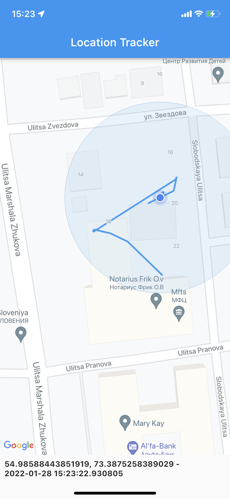

# location_tracker_sample Effective

An application to demostrate opportunities of location plugin in flutter

## Functions

- Getting current location of user
- Tracking location updates of user in foreground
- Tracking location updates of user in background
- Showing user location at Google Map
- Showing user way out of the previous locations

## Project launch

Supported platforms:
- Android SDK 20+
- iOS 9.0+

### Steps to launch project:

1. Clone repository `git clone https://github.com/rvachev/location_tracker_sample.git`
2. Get missed packages `flutter pub get`
3. Run project `flutter run`

## Screenshoots

## Issues

- `location` package that is used in an application has several troubles like:
  - it wasn't updated since spring 2021
  - it has many crashes
  - it has many issues that isn't solved by author and is closed by bot because of inactivity
  - it doesn't support Android 12
  - it has support iOS 9 which is unused for all Apple devices
